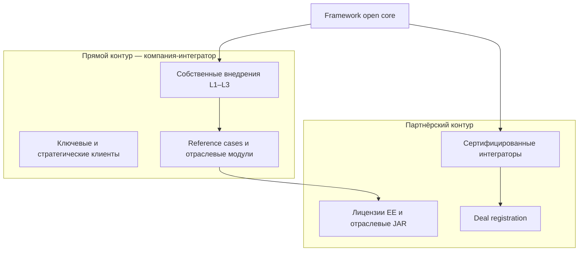
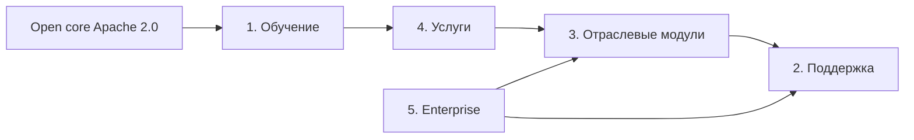

# Модель монетизации: open core и коммерческие потоки

Статус: **принято** (июнь 2026)  
Тип: продуктовое и коммерческое решение (ADR).

## Контекст

Framework позиционируется как **платформа для сборки MES-решений**, а не готовый продукт «из коробки» ([001-framework-primary-description.md](001-framework-primary-description.md)). Ядро (`framework.jar`), Plugin SPI и reference-примеры распространяются под **Apache License 2.0** (согласовано с зависимостями — Tomcat, RocksDB, Artemis в ADR 002–005).

Для устойчивого развития нужна **явная коммерческая модель**: что бесплатно в open core, что продаётся, как связаны потоки выручки, собственные внедрения и партнёрская сеть.

Исходные условия:

| Фактор | Содержание |
|--------|------------|
| **Организация** | Компания — **интегратор со своей платформой** (integrator + platform vendor), а не чистый ISV «только лицензии». Внедрение MES на Framework — основной вид деятельности; платформа — актив, ускоряющий проекты и создающий повторяющуюся выручку (лицензии, модули, поддержка). |
| Продукт | Framework + JAR plugins + прикладной `server/`; бизнес-логика — в модулях заказчика или отраслевых plugins. |
| Рынок | РФ/СНГ, импортозамещение, реестр отечественного ПО, Enterprise-заказчики; параллельно — **партнёрские интеграторы** на той же платформе. |
| Production | Собственные внедрения уже в production — прямые reference cases и обратная связь в продукт. |
| Зрелость кода | Ядро частично реализовано; Plugin SPI, workflow-native, Enterprise-фичи — в плане ([core-landscape.md](../architecture/core-landscape.md), [006-workflow-native-plugin.md](006-workflow-native-plugin.md)). |

Ранее модель монетизации в репозитории не была зафиксирована.

## Решение

**Коммерциализация Framework строится на модели open core (Apache 2.0) + пять коммерческих потоков в гибридной роли «интегратор + вендор платформы».** Ядро и контракты plugins остаются открытыми; доход — от **собственных внедрений**, лицензий, отраслевых модулей, поддержки и экосистемы партнёров.

### Роль на рынке: интегратор со своей платформой

| Аспект | Содержание |
|--------|------------|
| **Для заказчика** | «Мы внедряем MES на **своей** платформе» — один контракт, ответственность за результат, не перепродажа чужого ПО. |
| **Для рынка** | Платформа открыта (Apache 2.0) и доступна **другим интеграторам** — масштаб за пределами собственной ёмкости. |
| **Dogfooding** | Каждое собственное внедрение — источник требований к ядру, отраслевым plugins и Enterprise-фичам. |
| **Конкурентное преимущество** | Скорость и маржа внедрения выше, чем у интегратора на стороннем стеке; глубже экспертиза, чем у чистого ISV без поля. |

**Каналы продаж (два контура):**

| Контур | Кто продаёт | Кто внедряет | Типичный клиент |
|--------|-------------|--------------|-----------------|
| **Прямой** | Компания | Собственная команда | Ключевые аккаунты, сложные проекты, первая вертикаль |
| **Партнёрский** | Партнёр-интегратор | Партнёр (L1/L2), вендор — L3 при необходимости | Регионы, отрасли вне фокуса, объём после deal registration |

**Риск канального конфликта** (собственные продажи vs партнёры) снимается: deal registration, явное разделение сегментов (география, отрасль, размер сделки), партнёрские скидки на лицензии при внедрении партнёром.

Позиционирование для рынка: **«интегратор, который разработал платформу для MES — и открывает её экосистеме»**, а не абстрактная «платформа для чужих интеграторов» и не готовая замена SCADA «из коробки».

### Граница open core / commercial

| Компонент | Лицензия | Содержание |
|-----------|----------|------------|
| **Open core** | Apache 2.0 | `framework.jar`, `framework-api.jar` (Plugin SPI), документация, reference plugins, интеграционный `client/`, community support (best effort). |
| **Enterprise Edition** | Коммерческая подписка | LDAP/AD, HA/кластер, расширенный audit log, advanced RBAC, centralized config, multi-tenancy (по мере реализации). |
| **Отраслевые модули** | Коммерческая лицензия (perpetual + maintenance или subscription) | JAR plugins с отраслевой логикой (`mes-pharma.jar`, `mes-food.jar`, `mes-oee.jar` и т.д.). |
| **Услуги, обучение, поддержка** | Договор / тариф | Не входят в состав JAR; оформляются отдельными контрактами. |

### Пять коммерческих потоков

#### 1. Обучение и сертификация

| Уровень | Аудитория | Содержание | Формат |
|---------|-----------|------------|--------|
| **Developer** | Инженеры интеграторов, ИТ заводов | Plugin SPI, Entity, events, services, deploy | 3 дня, онлайн/очно |
| **Architect** | Архитекторы решений | MES на Framework, интеграции, HA, безопасность | 2 дня |
| **Certified Integrator** | Партнёры | Экзамен + одно внедрение под менторством; сертификат сроком 2 года | Экзамен + практика |

**Ориентир цен (РФ, 2026):** Developer 80–120 тыс ₽/чел; Architect 150–200 тыс ₽/чел; экзамен Certified 50–80 тыс ₽.

**Условие запуска:** стабильный Plugin SPI и reference plugin (hello MES). Сертификация — обязательное условие уровней **Silver/Gold** партнёрской программы.

#### 2. Техническая поддержка

| Тариф | SLA | Каналы | Привязка |
|-------|-----|--------|----------|
| **Community** | best effort | GitHub, Telegram | бесплатно |
| **Standard** | 8×5, ответ 1 раб. день | email, тикеты | Enterprise или отраслевой модуль |
| **Premium** | 24×7, P1 — 4 ч | phone, выделенный инженер | Enterprise Ultimate или крупный контракт |

**Ориентир:** Standard — 15–20% от годовой лицензии Enterprise; Premium — 30–40% или от 500 тыс ₽/год.

**Scope paid support:** баги в ядре и официальных plugins, upgrade, консультации в пределах N часов/мес. Кастомная разработка — поток **4 (услуги)**.

#### 3. Отраслевые модули

**Формат:** закрытые JAR plugins поверх открытого SPI; лицензия на **площадку** (site license).

| Модель | Описание |
|--------|----------|
| **Perpetual + maintenance** | Разовая лицензия + 20% maintenance/год (обновления, security) |
| **Subscription** | Годовая подписка на модуль |

**Ориентир цен:** subscription 500 тыс – 2 млн ₽/год; perpetual 1.5–5 млн ₽ + maintenance.

**Содержание модуля (пример):** дескрипторы Entity, workflow-шаблоны `*.process`, интеграции (1С, LIMS), отчёты, compliance-шаблоны. Первая вертикаль — отрасль **существующего production-клиента**, не абстрактный «идеальный» сегмент.

**Партнёры:** лицензия на модуль + royalty 15–25% при продаже через партнёра; **собственные внедрения** — модуль в составе проекта без посредника.

#### 4. Профессиональные услуги

| Тип | Содержание | Ориентир |
|-----|------------|----------|
| Discovery / аудит | AS-IS, roadmap, оценка | 300–500 тыс ₽, 2–4 недели |
| Внедрение MES | Сборка решения на Framework + plugins | 3–15 млн ₽ / проект |
| Интеграции | PLC, 1С, ERP, OPC | 150–300 тыс ₽ / интеграция |
| Кастомный plugin | Под заказчика | 2–5 тыс ₽/час или fixed price |
| Сопровождение / L2–L3 | Поддержка после внедрения | абонент или T&M |

**Роль для компании-интегратора:** **основной поток выручки** на горизонте 1–2 лет; платформа снижает срок и себестоимость внедрения → выше маржа, чем у интегратора на стороннем стеке. Каждый проект — кандидат в reference case и в отраслевой модуль (поток 3).

**Граница с партнёрами:** собственная команда — **полный цикл** (L1–L3) на прямых сделках; на партнёрских — партнёр L1/L2, компания L3 (архитектура, эскалации, обновления платформы). Партнёрам не конкурировать на зарегистрированных сделках.

**IP:** отработанная на проектах generic-логика — в open core или отраслевой JAR; уникальная специфика заказчика — по договору.

#### 5. Enterprise-фичи ядра

**Формат:** подписка **Enterprise Edition** (отдельный артефакт или feature flags + лицензионный ключ).

| Фича | Open core | Enterprise | Приоритет разработки |
|------|-----------|------------|-------------------|
| Single-node runtime | ✓ | ✓ | — |
| LDAP / Active Directory | — | ✓ | P0 |
| HA / кластер | — | ✓ | P0 |
| Audit log (immutable, export) | базовые логи | ✓ | P1 |
| Advanced RBAC | базовый JWT/roles | ✓ | P1 |
| Centralized config | — | ✓ | P2 |
| Multi-tenancy | — | ✓ | P2 (SaaS) |

**Тарифные планы (ориентир, РФ):**

| План | Цена/год | Включено |
|------|----------|----------|
| **Community** | 0 | framework, community support |
| **Professional** | 800 тыс – 1.5 млн ₽ | 1–3 узла, LDAP, audit, Standard support |
| **Enterprise** | 2–5 млн ₽ | HA, unlimited nodes, Premium support, до 40 ч custom/год |

Enterprise продаётся **конечному заказчику** MES: в **прямом контуре** — строка в договоре внедрения; в **партнёрском** — партнёр получает скидку по уровню программы.

### Синергия потоков

| Связь | Содержание |
|-------|------------|
| Обучение → услуги | Внутренние курсы для своей команды + сертификация партнёров; партнёры берут объём вне прямого контура. |
| Услуги → модули | Reference-внедрение упаковывается в отраслевой JAR. |
| Enterprise → поддержка | Корпоративные клиенты покупают SLA вместе с лицензией. |
| Модули → поддержка | Поддержка отраслевого модуля — отдельная строка или пакет с Enterprise. |

### Прогноз доли выручки (ориентир, модель интегратор + платформа)

| Поток | Год 1 | Год 3 |
|-------|-------|-------|
| 4. Проф. услуги (собственные внедрения) | ~45% | ~30% |
| 5. Enterprise | ~20% | ~25% |
| 3. Отраслевые модули | ~10% | ~25% |
| 2. Поддержка | ~15% | ~12% |
| 1. Обучение | ~5% | ~8% (в т.ч. партнёры) |
| Партнёрские лицензии (через контур 2) | ~5% | ~15% |

Год 1: собственные внедрения + Enterprise в составе проектов. Год 2–3: рост повторяющейся выручки (модули, поддержка, партнёрские лицензии); услуги остаются значимыми на ключевых аккаунтах, но доля снижается за счёт масштаба партнёров и продуктовой выручки.

### Партнёрская программа (связь с монетизацией)

| Уровень | Требования | Привилегии |
|---------|------------|------------|
| **Registered** | Регистрация | Документация, community |
| **Silver** | 1 внедрение + 1 Certified | Скидка 20% на Enterprise/модули, Standard support |
| **Gold** | 5 внедрений + 3 Certified | Скидка 35%, leads, совместный маркетинг |
| **Platinum** | 15+ внедрений, отраслевая экспертиза | Скидка 50%, partner manager, co-branding |

Deal registration — партнёры защищены от конкуренции с **прямым контуром** компании на той же сделке.

**Собственная команда vs партнёры:** компания не отказывается от внедрений; партнёрская сеть — **масштабирование**, а не замена интеграторской экспертизы.

### Обоснование

1. **Интегратор + платформа** — единая цепочка «продукт → внедрение → кейс → модуль»; быстрее итерации, чем у чистого ISV.
2. **Open core** — доверие рынка, реестр ПО, привлечение партнёров без закрытого ядра.
3. **Пять потоков** — услуги дают выручку и кейсы; Enterprise и модули — повторяющийся доход и маржа на масштабе.
4. **Два контура продаж** — прямой (маржа и контроль) + партнёрский (объём без линейного роста штата).
5. **Отраслевые JAR отдельно от ядра** — согласовано с архитектурой «ядро + plugins» ([006-workflow-native-plugin.md](006-workflow-native-plugin.md)).
6. **Enterprise в ядре** — HA/LDAP/audit нужны и собственным, и партнёрским внедрениям один раз.

**Не выбирается** как основная модель: чистый ISV без внедрений (теряется dogfooding и доверие заводов) или чистый интегратор без платформы (нет масштабируемого продукта и повторяющейся выручки).

## Последствия

| Область | Следствие |
|---------|-----------|
| Лицензирование | Публичный репозиторий — Apache 2.0; коммерческие артефакты — отдельные репозитории или private packages. |
| `framework-api` | SPI и reference plugins — open; отраслевые plugins — proprietary. |
| Enterprise | Отдельный build-профиль или `framework-enterprise.jar`; лицензионный ключ в `config.toml` (`[license]`). |
| Документация | После стабилизации: `guides/commercial-license.md`, partner portal, pricing (вне публичного ADR при необходимости). |
| Реестр ПО | Описание функционала — «платформа управления производством (MES)»; open core не мешает коммерческим модулям. |
| GTM | Прямой контур: кейсы **собственных** внедрений; реестр ПО; EE в составе проектных договоров. Партнёрский контур — после 2–3 упакованных кейсов. OSS — после Plugin SPI + hello-plugin. |
| Организация | Продуктовая команда (ядро, plugins) и интеграционная (внедрения) — явное разделение с общим backlog; приоритет фич — из production-проектов. |
| Юридические документы | EULA Enterprise, договор на отраслевой модуль, partner agreement, support SLA — вне репозитория кода. |

### Очередь реализации (коммерция ↔ продукт)

1. **Commercial license boundary** — документ: что в Apache 2.0, что в EE и vertical JAR.
2. **Plugin SPI** (`framework-api`) — блокер для обучения и OSS.
3. **Enterprise P0** — LDAP, audit (минимум для Professional).
4. **Enterprise P0** — HA/кластер (ADR масштабирования — отдельное решение).
5. **Partner program v0** — Registered/Silver, deal registration.
6. **Первый отраслевой модуль** — упаковка существующего production-кейса.
7. **Курсы Developer + Certified** — после стабильного SPI.

**Статус реализации (июнь 2026):** модель **принята**; юридические шаблоны, EE-сборка и partner portal — **в плане**.

## Связанные материалы

- [001-framework-primary-description.md](001-framework-primary-description.md) — платформа и бизнес-модули
- [006-workflow-native-plugin.md](006-workflow-native-plugin.md) — workflow plugin, SPI
- [architecture/core-landscape.md](../architecture/core-landscape.md) — зрелость ядра и plugins
- [architecture/application-layout-module.md](../architecture/application-layout-module.md) — lifecycle, сервисы
- [overview.md](../overview.md) — обзор продукта
